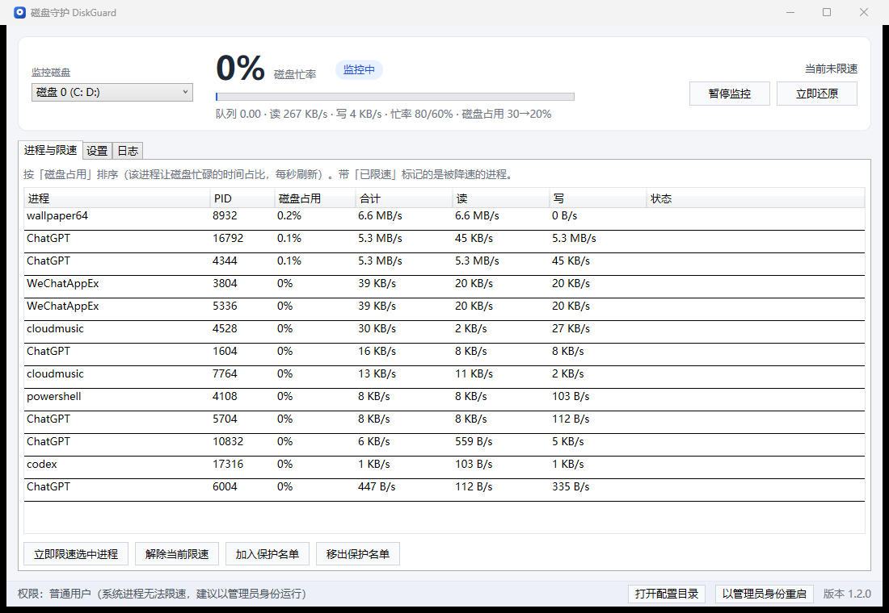

# 磁盘守护 DiskGuard

Windows 磁盘占用优化工具：**实时监控磁盘忙率，当"磁盘 0"持续繁忙时，自动对当前磁盘占用最高的进程限速，磁盘空闲后自动还原**，以缓解打字、输入法、前台软件卡顿。

打包好的程序：`dist\DiskGuard.exe`（单文件、免安装、自带 .NET 运行时，v1.2.0 起约 **57 MB**，此前为 68 MB）



---

## 1. 它是怎么工作的

每秒采样两类数据：

| 数据 | 来源 | 说明 |
| --- | --- | --- |
| 磁盘忙率 / 队列 / 读写吞吐 | Windows 性能计数器（PDH，`PhysicalDisk`） | 忙率 = 100% − 空闲时间占比，与任务管理器"磁盘占用率"口径一致 |
| **每个进程的磁盘占用百分比** | **管理员模式：ETW 内核磁盘事件**（每个 IO 的响应时间累加 ÷ 经过时间）<br>普通用户模式：按字节占比 × 磁盘忙率 估算 | "这个软件让磁盘忙了多久"，与传输量无关——大量小 IO、随机读写同样会被算成高占用 |

> 为什么不用 MB/s 判定？因为**占用率高 ≠ 传输量大**：4K 随机读写、FUA 落盘等场景下，某个进程可能只有几十 MB/s 却让磁盘几乎一直忙。按"磁盘占用百分比"判定才符合直觉。

判定与动作（全部参数可在界面里改）：

1. **触发**：磁盘忙率的 5 秒滑动平均 ≥ 80%，且存在磁盘占用 ≥ 30% 的进程（默认值，可改）。
   **紧急保护（默认开启）**：只要忙率 ≥ 98%（默认值，可改）持续 2 秒，**立即限速**——不等观察窗口、不校验占比，直接降优先级并施加吞吐上限，用于防止电脑突然卡死未响应。
2. **一级限速**：把该进程的**磁盘 IO 优先级降到最低**（可选同时降低 CPU 优先级）。这一步无感、可随时还原。
3. **闭环降占用**：5 秒后如果它的占用仍高于**目标占用（默认 20%）**，就用 Windows 存储 QoS 的作业对象施加磁盘吞吐上限（默认 30 MB/s）；仍不达标就每 5 秒收紧一次（30 → 15 → 7.5 → … 最低 2 MB/s），直到占用降到目标值以下。
   少部分自带沙箱的程序（如 Chromium 系浏览器、Electron 应用）会拒绝被加入，此时自动停留在"优先级限速"。
4. **强力模式**（默认关闭，界面上可开）：已到吞吐下限仍不达标时"间歇挂起/恢复"该进程，最有效，但被限速的程序会短暂无响应。
5. **保持与还原**：限速会**一直保持到该进程自己不再占用磁盘**（约 30 秒窗口内几乎无 IO）为止——避免"限速→磁盘空闲→解除→又被占满"来回抖动；进程退出、手动点"立即还原"、暂停监控或程序退出时也会还原。程序崩溃/被杀会写盘记录，下次启动自动修复残留限速。

被限速进程退出、或出现"占用达到 2 倍以上且超过触发线"的新进程时，会自动切换限速目标。

---

## 2. 使用方法

1. 双击 `dist\DiskGuard.exe`。建议**以管理员身份运行**（右下角按钮可一键重启提权）：

   - 管理员：使用 ETW 精确统计；可以限速 Defender、Windows 更新等系统用户态进程。
   - 普通用户：只能限速当前用户的普通进程（系统进程会提示"拒绝访问"）。

2. 「进程与限速」页签可以看到实时排行榜（每秒刷新）、当前限速对象和方式。

3. 「设置」页签可以调整：

   - 触发忙率/持续秒数、恢复忙率/持续秒数、最低速率（MB/s）
   - 触发忙率/持续秒数、恢复忙率/持续秒数
   - **触发磁盘占用（%）/ 目标磁盘占用（%）**、最小 IO 次数（次/秒）
   - **紧急保护**：忙率 ≥ 阈值（默认 98%）时立即限速，不等窗口
   - 是否降低磁盘 IO 优先级、优先级等级（极低/低）、是否同时降 CPU 优先级
   - 是否启用磁盘吞吐上限、上限值（MB/s）、升级等待秒数
   - 强力模式（间歇挂起）及运行/挂起毫秒数
   - 保护前台程序、保护名单（每行一个进程名）
   - 开机自动启动（**默认开启**，创建计划任务，登录后静默启动、免 UAC 弹窗）、启动时最小化到托盘（**默认开启**）、写日志、气泡提示

4. 关闭窗口会最小化到托盘并继续监控；托盘菜单可"暂停监控 / 立即还原全部限速 / 退出"。

5. 配置文件、日志、限速状态都在 `%LOCALAPPDATA%\DiskGuard\`（界面右下角"打开配置目录"）。

---

## 3. 已知边界（重要）

- **内核 "System" 进程（PID 4）无法限速**：驱动/内核发起的 IO、SSD 自身垃圾回收、部分 Windows 更新的内核路径，任何用户态程序都管不了。此时界面会提示"没有磁盘占用超过触发值的可限速进程"，不会误伤其它软件。
- **硬限速的适用范围**：作业对象限速对普通进程有效（实测 380 MB/s → 30 MB/s），但已在自身沙箱作业里的程序（Chrome/Edge、部分 Electron 应用）会返回"拒绝访问/不支持"，此时只保留优先级限速。
- **Windows Defender（MsMpEng）无法限速**：它是以 PPL 保护进程运行的，即使管理员也无法打开它修改优先级（界面会记录"拒绝访问"）。
- **精确占用统计需要管理员**：普通用户模式退回"按字节占比 × 磁盘忙率"的估算（对大批量读写准确，对小 IO 偏保守）；管理员模式下若 ETW 内核会话被系统占用，程序会依次尝试"私有会话"与"系统日志器"，都失败才降级。
- **IO 优先级查询**：极少数环境（例如受限沙箱）不允许读取进程的原始 IO 优先级，此时还原会使用系统默认值（普通优先级）。
- 本工具**不修改任何系统设置**（不改注册表、不关服务、不杀进程），只调整目标进程的 IO/CPU 优先级与吞吐上限，且随时可还原。

---

## 4. 常见问题

**Q: 为什么任务管理器显示磁盘 100%，但程序提示"没有可限速的进程"？**
常见于：Defender 扫描、Windows 更新的内核 IO、SysMain、SSD/HDD 自身回收。可以进一步排查是否为 SSD 性能抖动（低端 SSD 在持续写入后会出现"忙但不吞吐"的情况）。

**Q: 限速后那个程序会不会坏？**
不会。一级限速只改优先级；二级限速只是限制吞吐（类似限速下载），进程继续正常工作，只是变慢。强力模式（默认关闭）会让目标程序短暂停顿，属预期行为。

**Q: 打字/输入法会不会被限速？**
不会。默认保护名单包含 `TextInputHost.exe`、`ctfmon.exe`，并且默认"保护前台程序"（前台进程不会被限速）。
另外，已经被限速的程序一旦切换回前台（或被你加入保护名单），**1 秒内立即解除限速**，不会继续卡着你正在用的软件。
"保护前台程序"保护的是**整个程序**：浏览器、Electron、商店应用这类多进程软件，前台窗口所在进程的父进程与所有子进程（渲染/工具进程）都不会被限速。

**Q: 怎么卸载？**
退出程序 → 关闭"开机自动启动"（或删除计划任务 `DiskGuard_AutoStart`）→ 删除 exe 与 `%LOCALAPPDATA%\DiskGuard\` 目录即可。

---

## 5. 源码结构 / 重新构建

```
DiskGuard.sln         解决方案（一次编译三个项目）
src/DiskGuard.Core    引擎：性能计数器采样、ETW 统计、分级限速、设置与日志
src/DiskGuard.App     WPF 界面 + 托盘（前端）
src/DiskGuard.Cli     命令行自检工具：sample / etwtest / load / throttle / prio（测试用）
tools/               图标生成、窗口截图脚本
dist/                打包输出（单文件 exe，不纳入版本库）
```

```powershell
# 编译并运行（开发模式）
dotnet build src/DiskGuard.App/DiskGuard.App.csproj -c Debug
.\src\DiskGuard.App\bin\Debug\net8.0-windows\DiskGuard.exe

# 打包单文件 exe（自包含 win-x64 / 单文件 / 压缩 / 不带 PDB，参数已写进 csproj）
dotnet publish src/DiskGuard.App/DiskGuard.App.csproj -c Release -o dist

# 自检工具（可选）
.\src\DiskGuard.Cli\bin\Debug\net8.0-windows\DiskGuard.Cli.exe sample --seconds 5
.\src\DiskGuard.Cli\bin\Debug\net8.0-windows\DiskGuard.Cli.exe load --mb 1024 --seconds 20 --buffered
.\src\DiskGuard.Cli\bin\Debug\net8.0-windows\DiskGuard.Cli.exe load --random --mb 512 --seconds 20   # 4K 随机写：磁盘忙、吞吐低
.\src\DiskGuard.Cli\bin\Debug\net8.0-windows\DiskGuard.Cli.exe throttle --pid <PID> --cap 30 --seconds 15
```

打包体积为什么是 57 MB 而不是 150 MB：自包含发布本身要带完整 .NET 运行时，项目里为此做了三件事——
托盘图标改用 `Shell_NotifyIcon` 自己实现（不再引用 WinForms，发布时按框架清单剔除 WinForms 专属程序集）、
只保留 TraceEvent 需要的 `KernelTraceControl.dll`（amd64，其余原生组件与架构副本不打包）、发行包不带 PDB。

第三方依赖：仅 `Microsoft.Diagnostics.Tracing.TraceEvent`（微软官方，MIT，用于 ETW 内核磁盘事件）。

---

## 6. 参与开发

1. Fork 本仓库并新建分支（`feat/xxx`、`fix/xxx`）。
2. 提交前保证 `dotnet build DiskGuard.sln -c Release` 通过，并用 `DiskGuard.Cli` 的 `sample` / `load` 验证改动（涉及限速逻辑时建议以管理员运行）。
3. 提交信息写清"改了什么、为什么"；界面或行为变化请附截图。

CI（`.github/workflows/build.yml`）会在 Windows 上编译、跑一次采样自检，并产出单文件 exe 制品。

## 7. 许可

[MIT](LICENSE)。程序只调整目标进程的 IO/CPU 优先级与吞吐上限，不改注册表、不关服务、不杀进程；请自行评估在关键业务机器上使用的风险。

更新记录见 [CHANGELOG.md](CHANGELOG.md)。

---

版本：1.2.0
